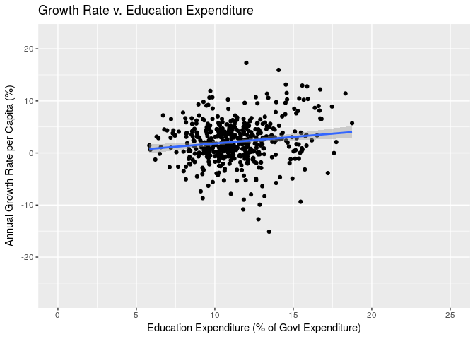
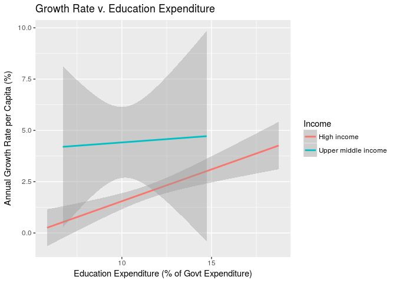
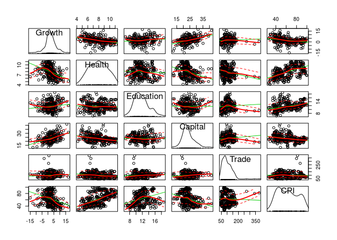
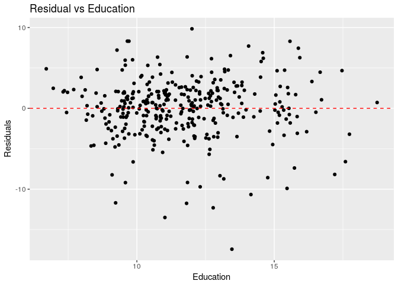
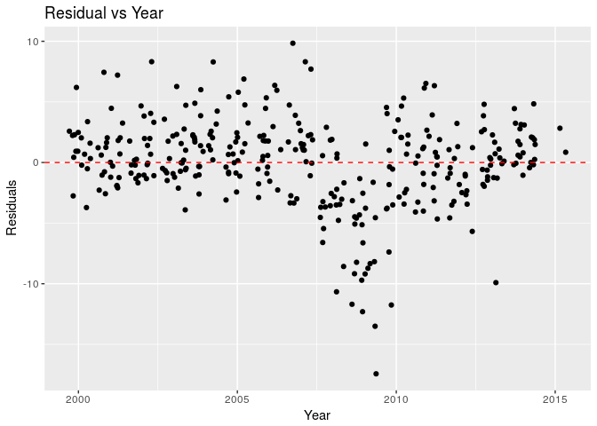

final\_project
================
Colin Pi
2018 5 28

``` r
library(readxl)
library(dplyr)
library(tidyr)
library(ggplot2)
library(car)
library(lmtest)
library(orcutt)
library(sandwich)
library(stargazer)
```

``` r
## Import the income classification data of countries coded by World Bank
income <- read_excel("CLASS.xls", skip = 3)[-1,] %>% select(Economy, `Income group`)
names(income)[1:2] <- c("Country","Income")

## Import World Bank Data and make some adjustment in variable names, such as year variables and country code. 
WBData <- read.csv("WBData.csv")[-c(131:135),]
names(WBData)[5:62] <- seq(1960,2017)
names(WBData)[3:4] <- c("Country","Code")

## Function of making wide version of data into narrower version
narrow <- function(i){
  outcome <- gather(WBData %>% filter(Series.Name == levels(WBData$Series.Name)[i]), key = Year, value = UQ(levels(WBData$Series.Name)[i]), 5:62) %>% select(6)
  return(outcome)
}

## Create a narrow version of World Bank Data
WBNarrow <- gather(WBData %>% 
                     filter(Series.Name == levels(WBData$Series.Name)[2]), 
                   key = Year, value = UQ(levels(WBData$Series.Name)[2]), 5:62) %>% 
  select(-c(1:2)) %>% bind_cols(lapply(c(3,5:6,8), narrow) %>% bind_cols())

## Coerce the character variable into numeric
WBNarrow[,4:8] <- sapply(WBNarrow[,4:8], as.numeric)

## Change the variable names in forms can be used for modeling
names(WBNarrow)[4:8] <- 
  c("Growth", "Health","Education", "Capital", "Trade")

## Join the World Bank Data and Income data
WBNarrow <- left_join(WBNarrow, income)

## Coerce the character variable into numeric
WBNarrow$Year <- as.numeric(WBNarrow$Year)
```

CPI Index
---------

``` r
## Import CPI data of 2017
cpi_2017 <- read_excel("CPI2017_FullDataSet.xlsx", skip=2)
cpi_2017 <- cpi_2017 %>% select(1,4)
names(cpi_2017)[2] = "2017"

## Import CPI data of 2016
cpi_2016 <- read_excel("CPI2016_FullDataSetWithRegionalTables.xlsx")
cpi_2016 <- cpi_2016 %>% select(1:2)
colnames(cpi_2016)[2] = "2016"

## Join CPI data of 2016 and 2017
cpi_2016_17 <- full_join(cpi_2016,cpi_2017, by = "Country")
cpi_2016_17 <- cpi_2016_17[-(181:182),]

## Import CPI data of 1998-2015
cpi_1998_2015 <- read_excel("CPI1998-2015.xlsx")

## Join CPI data of 1998-2015 and 2016-17
cpi_total <- full_join(cpi_1998_2015, cpi_2016_17, by = "Country")

## Since numeric data are framed as character, we changed them into numeric
cpi_total[,2:21] <- sapply(cpi_total[,2:21],as.numeric)

## The scale of CPI from 1998-2015 is out of 10, but it changed to out of 100 from 2012. So we changed the scale to out of 100.
cpi_total <- cpi_total %>% mutate_at(.vars = vars(names(cpi_total)[2:15]), funs(.*10))

## Create the narrow version of the CPI data
CPI <- gather(data = cpi_total, key = Year, value = CPI, 2:21)

## Change Year variable into numeric from character
CPI$Year <- as.numeric(CPI$Year)
```

``` r
## Join World Bank Data and CPI into one data frame.
allData <- left_join(WBNarrow, CPI)
```

Dependent Variable Growth: "Adjusted net national income per capita (annual % growth)"

Independent Variable Education: "Government expenditure on education, total (% of government expenditure)"

Control Variable Health: "Current health expenditure (% of GDP)"
Capital: "Gross capital formation (% of GDP)"
Trade: "Trade (% of GDP)" CPI: "Corruption Perception Index"

Growth v. Education
-------------------

``` r
ggplot(allData, aes(x = Education, y = Growth)) + 
  geom_point() +
  geom_smooth(method = "lm") + 
  scale_x_continuous(limits = c(0,25)) +
  labs(x = "Education Expenditure (% of Govt Expenditure)", y = "Annual Growth Rate per Capita (%)", title = "Growth Rate v. Education Expenditure")
```



Fixed Effect
------------

``` r
ggplot(allData, aes(x = Education, y = Growth, color = Income)) + 
  geom_smooth(method = "lm") + 
  labs(x = "Education Expenditure (% of Govt Expenditure)", y = "Annual Growth Rate per Capita (%)", title = "Growth Rate v. Education Expenditure")
```



Check for Necessary Transformation and Potential Multicollinearity
------------------------------------------------------------------

``` r
scatterplotMatrix(allData[c(4:8,10)])
```



Trade variable may be logged. Except that there is no need to transformation. Also there seems no multicollinearity issue either.

Model
-----

#### Bivariate Model (Growth v. Education)

``` r
bivariate.lm <- lm(Growth~Education, data = allData)
summary(bivariate.lm)
```

    ## 
    ## Call:
    ## lm(formula = Growth ~ Education, data = allData)
    ## 
    ## Residuals:
    ##     Min      1Q  Median      3Q     Max 
    ## -17.799  -2.024  -0.111   2.189  14.987 
    ## 
    ## Coefficients:
    ##             Estimate Std. Error t value Pr(>|t|)   
    ## (Intercept) -0.68923    0.89046  -0.774  0.43928   
    ## Education    0.25141    0.07739   3.249  0.00124 **
    ## ---
    ## Signif. codes:  0 '***' 0.001 '**' 0.01 '*' 0.05 '.' 0.1 ' ' 1
    ## 
    ## Residual standard error: 3.881 on 514 degrees of freedom
    ##   (992 observations deleted due to missingness)
    ## Multiple R-squared:  0.02012,    Adjusted R-squared:  0.01821 
    ## F-statistic: 10.55 on 1 and 514 DF,  p-value: 0.001235

We can see a significant positive relation between both variables.

#### Full model

``` r
growth.lm <- lm(Growth ~ log(Trade) + Health + Capital + CPI + factor(Income) + Education, data = allData)
summary(growth.lm)
```

    ## 
    ## Call:
    ## lm(formula = Growth ~ log(Trade) + Health + Capital + CPI + factor(Income) + 
    ##     Education, data = allData)
    ## 
    ## Residuals:
    ##      Min       1Q   Median       3Q      Max 
    ## -17.3978  -1.7157   0.2907   2.0191   9.7729 
    ## 
    ## Coefficients:
    ##                                   Estimate Std. Error t value Pr(>|t|)    
    ## (Intercept)                       -2.60810    3.27933  -0.795  0.42700    
    ## log(Trade)                        -0.20522    0.55385  -0.371  0.71123    
    ## Health                            -0.50328    0.15898  -3.166  0.00169 ** 
    ## Capital                            0.30964    0.04920   6.293 9.85e-10 ***
    ## CPI                               -0.02581    0.01447  -1.783  0.07545 .  
    ## factor(Income)Upper middle income  0.89250    0.76197   1.171  0.24232    
    ## Education                          0.33145    0.10368   3.197  0.00152 ** 
    ## ---
    ## Signif. codes:  0 '***' 0.001 '**' 0.01 '*' 0.05 '.' 0.1 ' ' 1
    ## 
    ## Residual standard error: 3.682 on 332 degrees of freedom
    ##   (1169 observations deleted due to missingness)
    ## Multiple R-squared:  0.2717, Adjusted R-squared:  0.2585 
    ## F-statistic: 20.64 on 6 and 332 DF,  p-value: < 2.2e-16

#### Restricted model

``` r
growth.lm2 <- lm(Growth ~ Health + Capital + CPI + factor(Income) + Education, data = na.omit(allData))
summary(growth.lm2)
```

    ## 
    ## Call:
    ## lm(formula = Growth ~ Health + Capital + CPI + factor(Income) + 
    ##     Education, data = na.omit(allData))
    ## 
    ## Residuals:
    ##      Min       1Q   Median       3Q      Max 
    ## -17.4296  -1.7157   0.3246   2.0565   9.8441 
    ## 
    ## Coefficients:
    ##                                   Estimate Std. Error t value Pr(>|t|)    
    ## (Intercept)                       -3.50044    2.22288  -1.575  0.11627    
    ## Health                            -0.49386    0.15673  -3.151  0.00177 ** 
    ## Capital                            0.30707    0.04865   6.312 8.81e-10 ***
    ## CPI                               -0.02588    0.01445  -1.791  0.07428 .  
    ## factor(Income)Upper middle income  0.91945    0.75751   1.214  0.22569    
    ## Education                          0.32725    0.10293   3.179  0.00161 ** 
    ## ---
    ## Signif. codes:  0 '***' 0.001 '**' 0.01 '*' 0.05 '.' 0.1 ' ' 1
    ## 
    ## Residual standard error: 3.677 on 333 degrees of freedom
    ## Multiple R-squared:  0.2714, Adjusted R-squared:  0.2605 
    ## F-statistic: 24.81 on 5 and 333 DF,  p-value: < 2.2e-16

We got rid of the Trade variable (the p-value for this coefficient is too big).

Multicollinearity
-----------------

``` r
vif(growth.lm2)
```

    ##         Health        Capital            CPI factor(Income)      Education 
    ##       1.641272       1.150975       1.908657       1.298126       1.265574

No evidence of multicollinearity.

Heteroscedasity
---------------

#### Graphical Method

``` r
ggplot(growth.lm2, aes(x=na.omit(allData)$Education, y=.resid)) + 
  geom_jitter() +
  geom_hline(yintercept=0, col="red", linetype="dashed") +
  labs(title = "Residual vs Education", x="Education", y = "Residuals")
```



Not sure whether there is a notable heteroscedasity issue.

#### GQ test

``` r
gqtest(growth.lm2, fraction = 4, order.by = na.omit(allData)$Education)
```

    ## 
    ##  Goldfeld-Quandt test
    ## 
    ## data:  growth.lm2
    ## GQ = 1.6732, df1 = 162, df2 = 161, p-value = 0.0005832
    ## alternative hypothesis: variance increases from segment 1 to 2

We can find the evidence of heteroscedasity.

Autocorrelation
---------------

Because it is a timeseries data, we may suspect there is the autocorrelation issue.

#### Graphical Methods

``` r
ggplot(growth.lm2, aes(x=na.omit(allData)$Year, y=.resid)) + 
  geom_jitter() +
  geom_hline(yintercept=0, col="red", linetype="dashed") +
  labs(title = "Residual vs Year", x="Year", y = "Residuals")
```



#### Durbin-Watson, BG test

``` r
dwtest(growth.lm2, order.by = na.omit(allData)$Year)
```

    ## 
    ##  Durbin-Watson test
    ## 
    ## data:  growth.lm2
    ## DW = 1.1302, p-value = 3.708e-16
    ## alternative hypothesis: true autocorrelation is greater than 0

``` r
bgtest(growth.lm2, order.by = na.omit(allData)$Year)
```

    ## 
    ##  Breusch-Godfrey test for serial correlation of order up to 1
    ## 
    ## data:  growth.lm2
    ## LM test = 65.791, df = 1, p-value = 5.014e-16

#### Cochrane Orcutt

``` r
growth.orcutt <- cochrane.orcutt(growth.lm2)
summary.orcutt(growth.orcutt)
```

    ## Call:
    ## lm(formula = Growth ~ Health + Capital + CPI + factor(Income) + 
    ##     Education, data = na.omit(allData))
    ## 
    ##                                    Estimate Std. Error t value  Pr(>|t|)
    ## (Intercept)                       -4.117008   1.863737  -2.209 0.0278567
    ## Health                            -0.321746   0.131625  -2.444 0.0150286
    ## Capital                            0.262060   0.042966   6.099 2.964e-09
    ## CPI                               -0.040170   0.013515  -2.972 0.0031725
    ## factor(Income)Upper middle income  2.148505   0.636241   3.377 0.0008202
    ## Education                          0.420186   0.081909   5.130 4.939e-07
    ##                                      
    ## (Intercept)                       *  
    ## Health                            *  
    ## Capital                           ***
    ## CPI                               ** 
    ## factor(Income)Upper middle income ***
    ## Education                         ***
    ## ---
    ## Signif. codes:  0 '***' 0.001 '**' 0.01 '*' 0.05 '.' 0.1 ' ' 1
    ## 
    ## Residual standard error: 3.2845 on 332 degrees of freedom
    ## Multiple R-squared:  0.3255 ,  Adjusted R-squared:  0.3153
    ## F-statistic: 32 on 5 and 332 DF,  p-value: < 1.255e-26
    ## 
    ## Durbin-Watson statistic 
    ## (original):    1.13022 , p-value: 3.708e-16
    ## (transformed): 2.11425 , p-value: 8.715e-01

The problem with Cochrane Orcutt is that we cannot address for heteroscedasity.

#### Newey West

``` r
growth.newey <- coeftest(growth.lm2, vcov = NeweyWest(growth.lm))
growth.newey
```

    ## 
    ## t test of coefficients:
    ## 
    ##                                    Estimate Std. Error t value  Pr(>|t|)
    ## (Intercept)                       -3.500445   2.360010 -1.4832 0.1389583
    ## Health                            -0.493855   0.134709 -3.6661 0.0002866
    ## Capital                            0.307071   0.068710  4.4691 1.078e-05
    ## CPI                               -0.025877   0.018262 -1.4170 0.1574087
    ## factor(Income)Upper middle income  0.919452   0.914141  1.0058 0.3152375
    ## Education                          0.327255   0.108138  3.0263 0.0026687
    ##                                      
    ## (Intercept)                          
    ## Health                            ***
    ## Capital                           ***
    ## CPI                                  
    ## factor(Income)Upper middle income    
    ## Education                         ** 
    ## ---
    ## Signif. codes:  0 '***' 0.001 '**' 0.01 '*' 0.05 '.' 0.1 ' ' 1

Newey West deals with both heteroscedasity and autocorrelation. The problem is the Orcutt model is better than this version. Still Education coefficient is significant.
